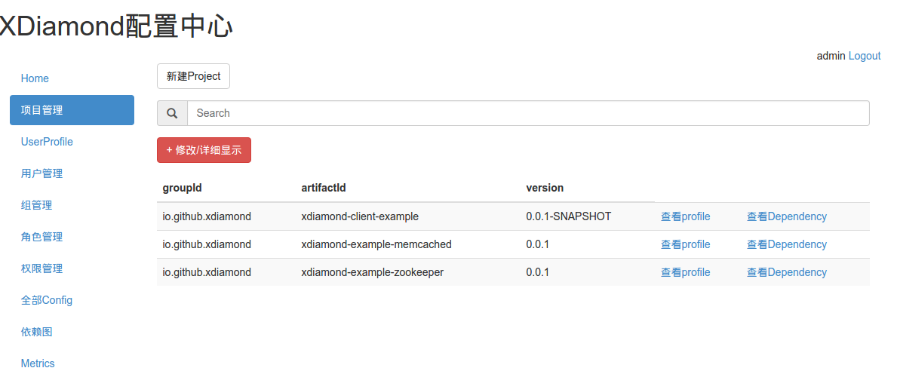
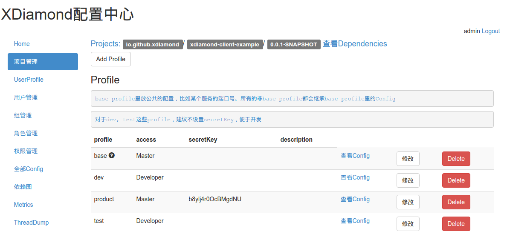
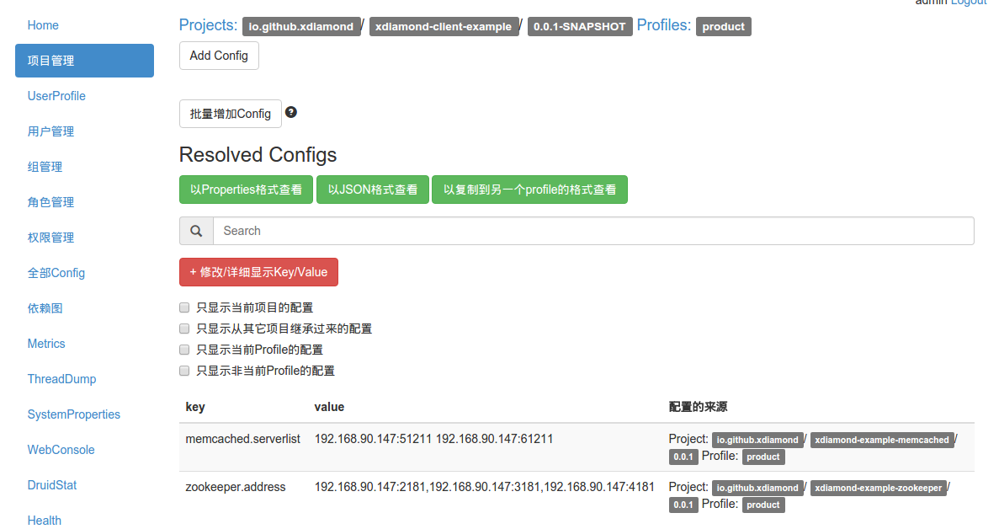
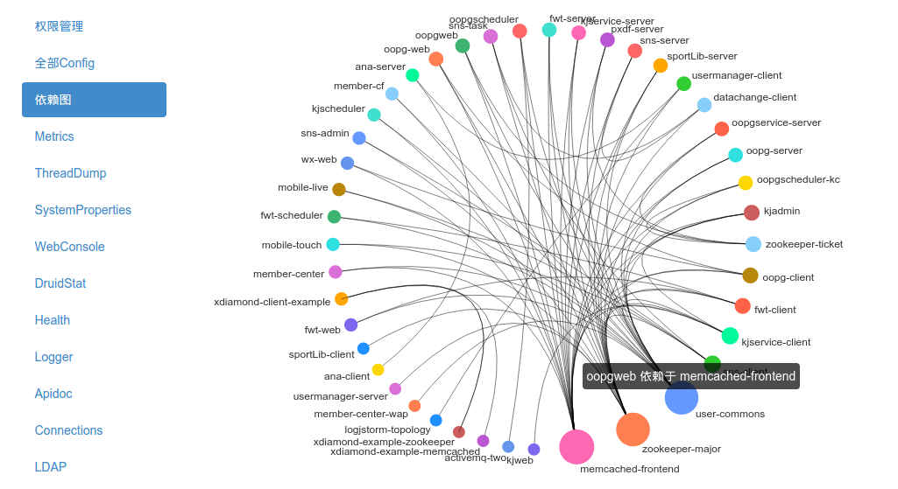
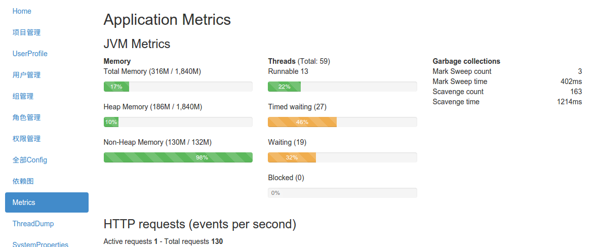



## 简介

全局配置中心，存储应用的配置项，解决配置混乱分散的问题。名字来源于淘宝的开源项目[diamond](http://code.taobao.org/p/diamond/src/ "")，前面加上一个字母X以示区别。

[wiki](https://github.com/hengyunabc/xdiamond/wiki "")

[设计思路](https://github.com/hengyunabc/xdiamond/wiki/%E8%AE%BE%E8%AE%A1%E6%80%9D%E8%B7%AF "")

* 交流QQ群 450548123

## 在线演示
地址：[xdiamond.coding.io](http://xdiamond.coding.io/ "")，登陆**选择standard**，用户名密码：admin/admin


## 特性

* 所见即所得，在管理界面上看到的所有配置即项目运行时的配置
* 支持groupId，artifactId，version，profile四个维度以应对复杂环境
* 支持公共组件的配置继承，client jar包配置继承
* 配置修改实时通知客户端
* 和spring集成，使用简单
* **完善的权限系统**
* 集成LDAP登陆，支持同步LDAP组/用户
* 支持http RESTful api获取配置
* 以secret key防止非法获取配置
* 丰富的metrics, connection统计

## 使用技术

* netty
* mybatis
* spring mvc
* shiro
* ehcache
* dropwizard metrics
* crash shell
* swagger
* angularjs
* bootstrap
* bower


## 工作原理

* 每个项目有groupId，artifactId，version，然后在不同的环境里对应不同的profile，比如：test, dev, product。

* 应用在启动时，通过网络连接到xdiamond配置中心，获取到最新的配置。如果没有获取到，从本地备份读取最后拉取的配置。

* 在Spring初始化时，把配置转为Properties，应用可以通过````${}````表达式或者````@Value````来获取配置。

* 如果配置有更新，可以通过Listener来通知应用。

每个项目都有一个base的profile，所有的profile都会继承base的配置。在base可以放一些公共的配置，比如某个服务的端口。

对于使用者，xdiamond提供的是一个Properties对象。用户可以结合Spring等来使用。

## 界面截图
* 项目管理：

* Profile管理：

* Config管理：

* 项目依赖关系图：

* Metrics信息：

* Connection信息：


## 本地开发环境
* git clone 代码
* 运行xdiamond server：

```bash
git clone https://github.com/hengyunabc/xdiamond.git --depth=1
cd xdiamond/xdiamond-server
mvn tomcat7:run -DskipTests
```
然后访问 http://localhost:8080/xdiamond-server ，用admin/admin, standard登录

* 执行client例子代码：

```bash
cd xdiamond-client-example/
mvn exec:java -Dexec.mainClass="io.github.xdiamond.example.ClientExampleMain"
```
默认是获取product环境的配置，如果想获取dev环境的配置，则可以执行：
```bash
mvn exec:exec -Dexec.executable="java" -Dexec.args="-Dxdiamond.project.profile=dev -classpath %classpath io.github.xdiamond.example.ClientExampleMain"
```
* 演示结果

client启动时会打印获取到的配置，另外在web界面上connections里可以看到当前连接的客户端信息。

## maven dependency

maven依赖已经发布到中央仓库：http://search.maven.org/#search%7Cga%7C1%7Cxdiamond

```xml
<dependency>
    <groupId>io.github.hengyunabc.xdiamond</groupId>
    <artifactId>xdiamond-client</artifactId>
    <version>1.0.4</version>
</dependency>
```
